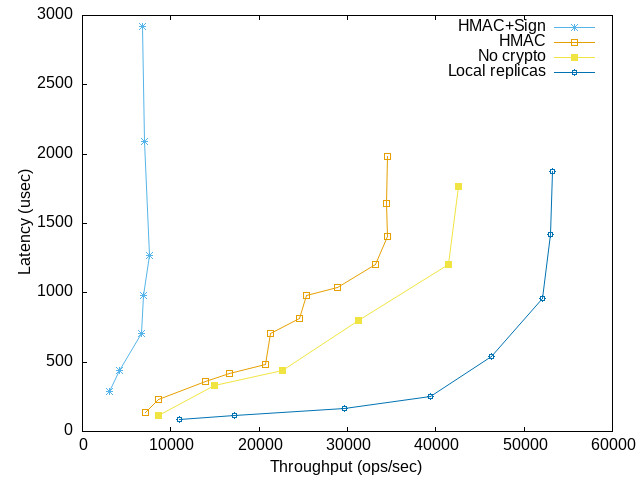
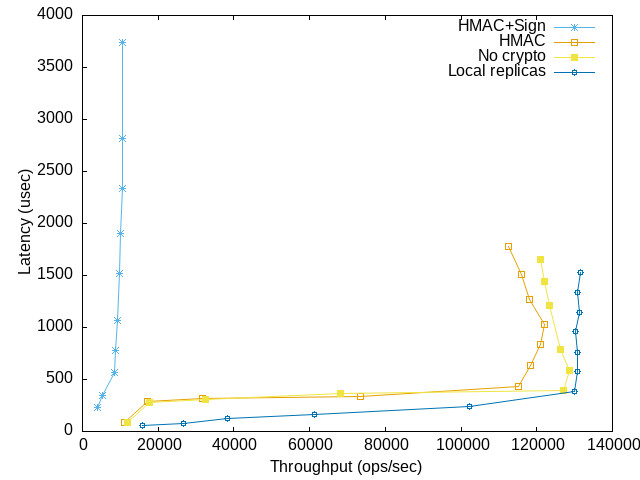

# SimpleBFT

A very simple implementation of the PBFT 3-phase commit protocol in Rust.

Features:
 - UDP; clients and the primary (replica 0) have non-blocking sockets;
 - messages are authenticated with HMAC+SHA256;
 - client requests are signed with ED25519;
 - batching of the requests in the Pre-prepare.

Missing features:
 - checkpointing;
 - view change;
 - multithreading at the replicas;
 - retransmissions;
 - strong fault-tolerance; e.g., if you kill a replica and run it again it will
 not participate in the protocol. Flooding attacks, etc. are also possible;
 - all the messages need to fit in a single UDP packet.

Future planned features:
 - DPDK or XDP for network communications.

## Walkthrough

Running the replicas and clients is done in three steps:

1) Creating a configuration file, which contains, for each replica and clients
(in order), their IP, port HMAC key, and signature key (a concatenation of the
public and private key). A special value of `NONE` for the HMAC (resp.
signature) key means it is disabled.

For example, this file would be used to run 4 replicas and 2 clients on the same machine, without message authentication and signature:
```
$ cat nodes.txt
# IP	PORT	HMAC	KEY==concat(pub+priv)
127.0.0.1	6000	NONE NONE
127.0.0.1	6001	NONE NONE
127.0.0.1	6002	NONE NONE
127.0.0.1	6003	NONE NONE
127.0.0.1	8000	NONE NONE
127.0.0.1	8001	NONE NONE
```

While this file would be used to run 4 replicas and 2 clients with message authentication and signature:
```
$ cat nodes_enc.txt
# IP	PORT	HMAC	KEY==concat(pub+priv)
127.0.0.1	6000	replica1 NONE
127.0.0.1	6001	replica2	NONE
127.0.0.1	6002	replica3	NONE
127.0.0.1	6003	replica4	NONE
127.0.0.1	8000	client1	42177206f5e9a64b12f44826bf917a65e958aaf2cd97464be33e8f7d86a65d722b794e21f3fd0ac8bdef1172f4f6cb1405043e469d33b812342a8a8f41b882c5
127.0.0.1	8001	client2	42177206f5e9a64b12f44826bf917a65e958aaf2cd97464be33e8f7d86a65d722b794e21f3fd0ac8bdef1172f4f6cb1405043e469d33b812342a8a8f41b882c5
```

2) Running the replicas. Open as many terminals as there are replicas and execute the following command:
```
$ cargo run --release --bin replica <configuration_file><f> <id> <response_size>
```

E.g., for 4 replicas and empty replies:
```
node-0$ cargo run --release --bin replica nodes.txt 1 0 0
node-1$ cargo run --release --bin replica nodes.txt 1 1 0
node-2$ cargo run --release --bin replica nodes.txt 1 2 0
node-3$ cargo run --release --bin replica nodes.txt 1 3 0
```

3) Running the clients. Each client process can run several clients, each in its own thread:
```
$ cargo run --release --bin client <configuration_file> <f> <first_id> <#clients> <duration> <request_size>
```

E.g., to run 10 clients for 10 seconds with an empty request size:
```
clients$ cargo run --release --bin client nodes.txt 1 4 10 10 0
```

## Testing


More seriously, there are a few tests that you can run with `cargo test`.

## Evaluation

# Setup

The performance of RustyBFT has been evaluated on 5 identical machine of the c6525-100g cluster at [Cloudlab(https://cloudlab.us)]. The machines have an AMD EPYC Rome 7402P processor @2.80GHz, 128GB of RAM, and run Ubuntu 20.04 and are interconnected via 100Gbps links. In the following evaluation the Linux socket API is used. Unless specified otherwise, one machine executes the clients while each other machine executes one replica. We set the number of tolerated faults to $f = 1$, hence 4 replicas.

RustyBFT is evaluated in the following settings:
- local replicas, where the replicas are all executed on the same machine;
- no crypto, where replicas and clients do not check the HMAC nor signature of the messages;
- HMAC, where replicas do not check client requests signatures;
- HMAC+Sign, where MAC and signatures are checked.

# Results

The folowing two figures show the latency (in microseconds) as a function of the throughput (in operations per second) in two cases: (1) Empty requests and replies; and (2) 4kB requests and replies.




First, we can observe that signatures are very costly. We measured that signature verification takes 80% of the cycles at the primary.
Second, executing the replicas on the same machine reduces the latency by up to 2x while also increasing the maximum throughput by 25%. This shows how decreasing the consensus latency improves the performance.

